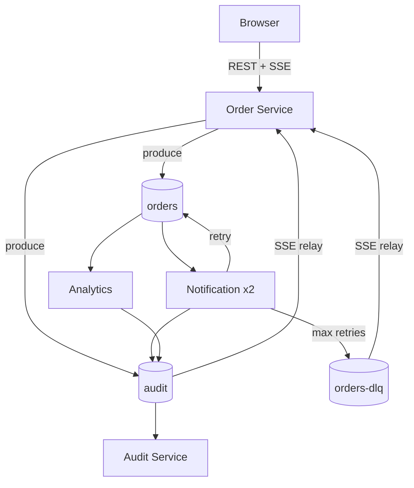
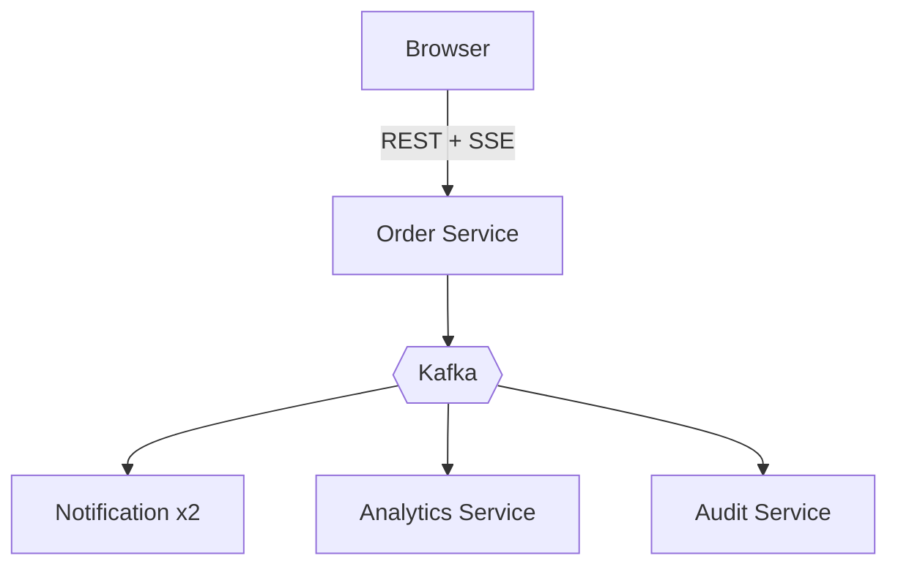
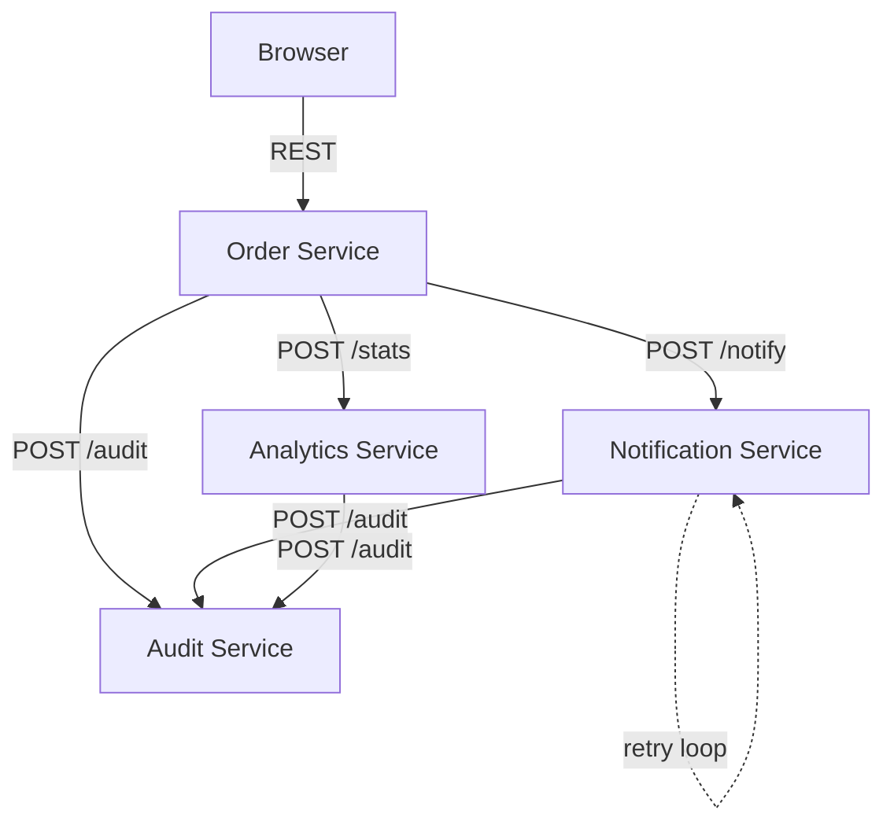

# Kafka Dojo — Food Ordering Demo

A food ordering system where customers place orders (think Uber Eats or Deliveroo behind the scenes). When an order comes in, multiple things need to happen at once: the customer gets a notification, analytics dashboards update, and an audit trail is recorded. Instead of one monolith doing all of this sequentially, each concern is its own service communicating through Kafka events.

This is a workshop demo — no real database, no real payments — but the architecture mirrors how production event-driven systems work.

## Architecture



## With Kafka — Asynchronous Events



**Benefits:**
- **Loose coupling** — Order Service just produces events, doesn't know who consumes
- **Fault tolerance** — if Notification is down, messages wait in the topic
- **Parallelism** — consumers process in parallel across partitions
- **Easy scaling** — add consumers without changing producer code
- **Built-in retry** — re-produce to topic with retry header, DLQ after max attempts

## Without Kafka — Synchronous REST



**Problems with this approach:**
- **Tight coupling** — Order Service must know every downstream service URL
- **Cascading failures** — if Notification is down, the order request fails
- **No parallelism** — calls are sequential or require manual fan-out
- **Retry complexity** — each service implements its own retry/circuit-breaker logic
- **Adding a service** — requires changing Order Service code to call the new endpoint

## Event Shapes

### `orders` topic

Produced by Order Service on every create, update, or delete.

```json
{
  "action": "created | updated | deleted",
  "order": {
    "id": "uuid",
    "customerName": "Alice",
    "item": "Pizza",
    "quantity": 2,
    "price": 12.99,
    "status": "created",
    "createdAt": "2026-02-05T13:11:17.406Z"
  },
  "timestamp": "2026-02-05T13:11:17.406Z"
}
```

**Headers:** `retryCount` (added by Notification Service on retry, starts at `"1"`)

### `audit` topic

Produced by every service. Shape varies by source:

**From Order Service:**
```json
{
  "source": "order-service",
  "action": "created | updated | deleted",
  "orderId": "uuid",
  "order": { },
  "timestamp": "..."
}
```

**From Notification Service:**
```json
{
  "source": "notification-service",
  "action": "NOTIFIED | RETRY | DLQ",
  "orderId": "uuid",
  "instanceId": "notification-1",
  "retryCount": 2,
  "timestamp": "..."
}
```

**From Analytics Service:**
```json
{
  "source": "analytics",
  "action": "STREAM_STATS",
  "orderId": "uuid",
  "stats": {
    "ordersPerMinute": 12,
    "notificationSuccessRate": "85.7%",
    "notificationOutcomes": { "NOTIFIED": 6, "RETRY": 3, "DLQ": 1 },
    "avgNotificationLatencyMs": 45
  },
  "timestamp": "..."
}
```

### `orders-dlq` topic

Produced by Notification Service after 3 failed retries.

```json
{
  "action": "created",
  "order": { },
  "reason": "Max retries exceeded",
  "instanceId": "notification-2",
  "timestamp": "..."
}
```

## Quick Start

```bash
docker compose up --build
```

- **Dashboard:** http://localhost:3001
- **Kafka UI:** http://localhost:8080
