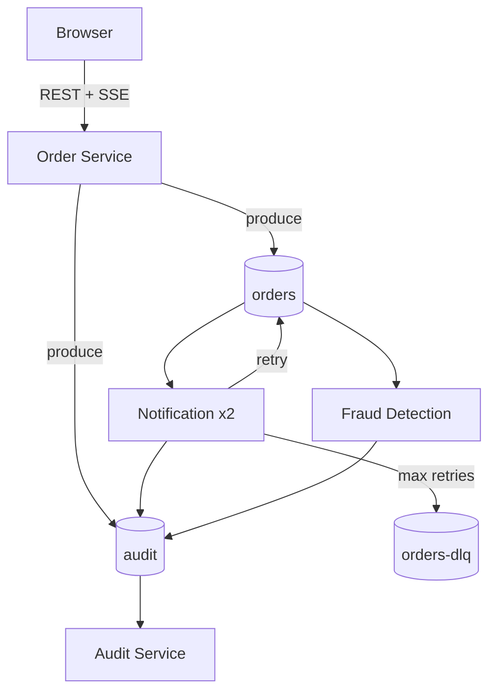
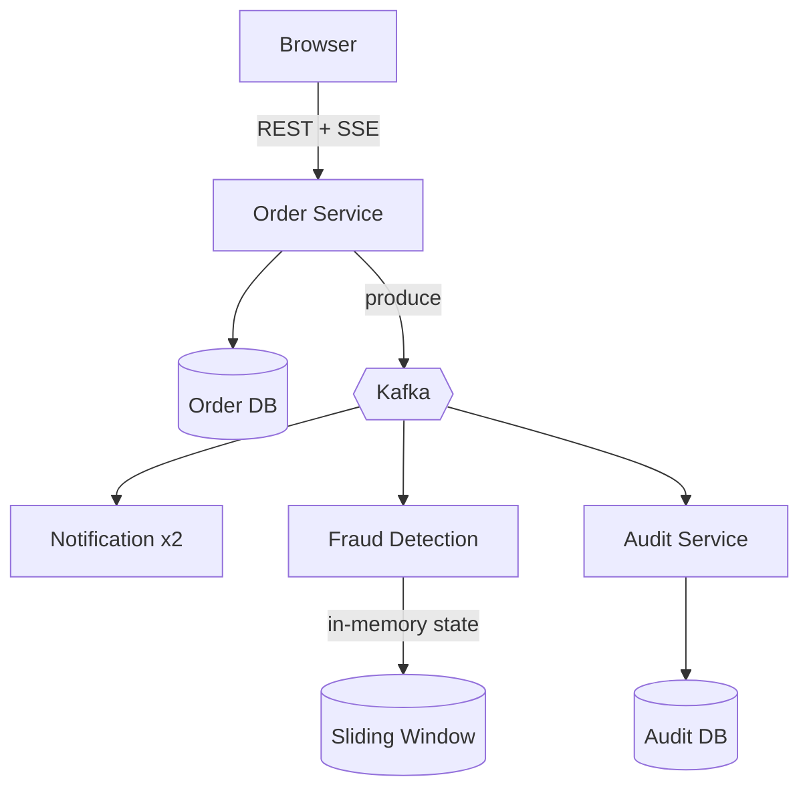
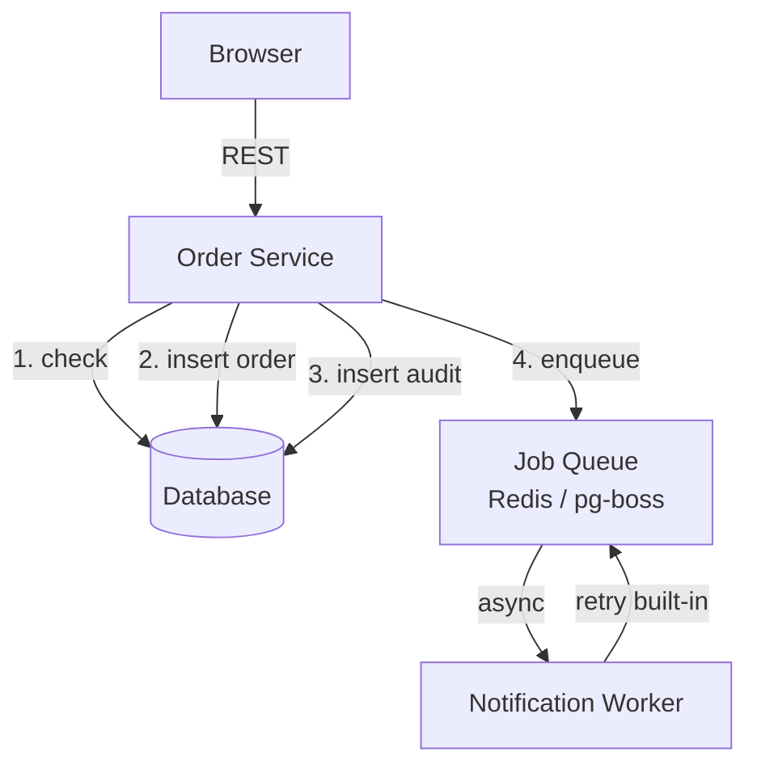
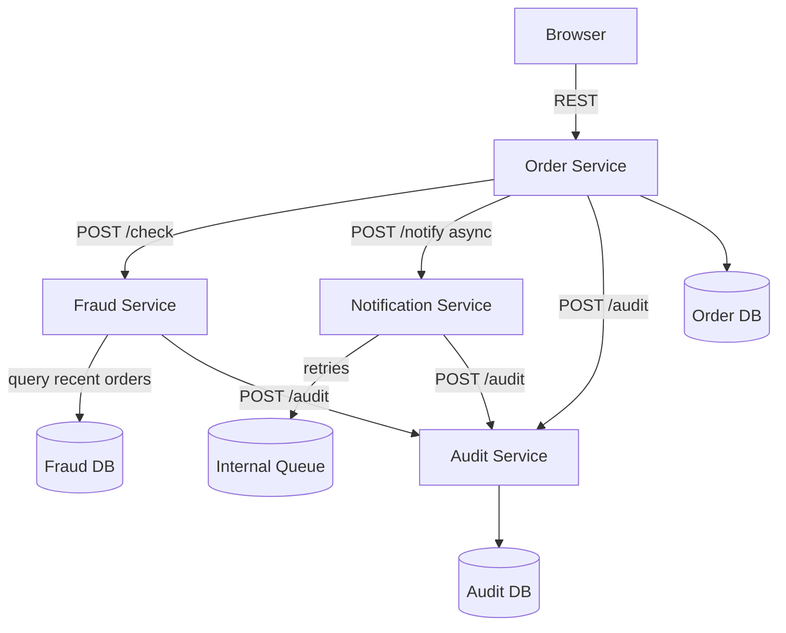

# Kafka Dojo — Food Ordering Demo

A food ordering system where customers place orders (think Uber Eats or Deliveroo behind the scenes). When an order comes in, multiple things need to happen at once: the customer gets a notification, fraud detection runs in real-time, and an audit trail is recorded. Instead of one monolith doing all of this sequentially, each concern is its own service communicating through Kafka events.

This is a workshop demo — no real database, no real payments — but the architecture mirrors how production event-driven systems work.

## Architecture



## At a Glance

### Services

| Service | Container | Host Port | Role |
| --- | --- | --- | --- |
| Order Service | `order-service` | `3001` | REST API + SSE; produces `orders` + `audit`; relays `audit` + `orders-dlq` to SSE |
| Notification Service (x2) | `notification-1`, `notification-2` | — | Consumes `orders`; retries or DLQ; produces `audit` |
| Analytics Service | `analytics-service` | — | Consumes `orders` (skips retried); updates stats; produces `audit` |
| Audit Service | `audit-service` | — | Consumes `audit`; logs events |
| Kafka UI | `kafka-ui` | `8080` | Inspect topics and messages |
| Kafka Broker | `kafka` | `29092` (external) | Kafka broker for all services |

### Topics

| Topic | Partitions | Producers | Consumers | Notes |
| --- | --- | --- | --- | --- |
| `orders` | 3 | Order Service, Notification Service (retry) | Notification Service, Analytics Service | Retries re-produce to `orders` with `retryCount` header |
| `orders-dlq` | 1 | Notification Service | Order Service (SSE relay) | Emitted after max retries |
| `audit` | 1 | Order, Notification, Analytics Services | Audit Service, Order Service (SSE relay) | Unified audit stream |

## Event Flow (Happy Path + Failure)

1. Browser sends REST request to Order Service. The order is stored in memory and an `orders` event is produced. An `audit` event is also produced, and an SSE `order` event is broadcast.
1. Notification Service instances consume from `orders` in the same consumer group. On success they emit `audit: NOTIFIED`.
1. If notification fails, the message is re-produced to `orders` with a `retryCount` header and `audit: RETRY`. If `retryCount` is already `2`, the message is sent to `orders-dlq` with `audit: DLQ`.
1. Analytics Service consumes `orders` and ignores messages that include `retryCount` to avoid double-counting. It updates in-memory stats and emits `audit: STATS_UPDATED`.
1. Audit Service consumes `audit` and logs the event.
1. Order Service also consumes `audit` and `orders-dlq` to relay them over SSE as `audit` and `dlq` event types.

## SSE Stream

The Order Service exposes an SSE endpoint at `/events`. Each SSE message has the envelope:

```json
{ "type": "order | audit | dlq", "data": { }, "timestamp": "..." }
```

## With Kafka — Asynchronous Events



**Key difference:** Order Service just writes to its DB and publishes an event. It doesn't know or care who consumes it.

**Benefits:**
- **Loose coupling** — Order Service just produces events, doesn't know who consumes
- **Fault tolerance** — if Notification is down, messages wait in the topic
- **Parallelism** — consumers process in parallel across partitions
- **Easy scaling** — add consumers without changing producer code
- **Built-in retry** — re-produce to topic with retry header, DLQ after max attempts
- **Fraud at scale** — sliding window state in memory, fed by stream (no DB polling)

## Without Kafka — The Honest Version

For a small-to-medium system, you don't need Kafka. A well-designed monolith works fine:



**This works well because:**
- Fraud check is **synchronous** — actually blocks bad orders
- Notification is **async** via job queue — doesn't slow down the order
- Audit is just a DB table — no separate service needed
- Simple retry via job queue (Redis, pg-boss, Sidekiq, etc.)

**Where it breaks down (and Kafka helps):**

| Scale | Problem | Kafka solution |
|-------|---------|----------------|
| ~100 orders/sec | DB fraud query becomes bottleneck | In-memory stream state |
| Multiple teams | Everyone touches the monolith | Independent consumers |
| New requirements | "Add ML fraud model" = redeploy Order Service | Just add a consumer |
| Debugging | "What happened to order X?" = query multiple tables | Replay events |
| Burst traffic | Job queue + DB can't keep up | Partitioned parallelism |

**TL;DR:** Kafka isn't about making simple things possible — it's about making complex things manageable at scale.

## Without Kafka — Microservices over REST

When you outgrow the monolith but don't have Kafka:



**Trade-offs:**
- **Service discovery** — Order Service needs to know where Fraud, Notification, Audit live
- **Failure handling** — What if Fraud Service is down? Block orders? Skip check? Circuit breaker?
- **Distributed transactions** — Order created but audit failed — now what?
- **Fan-out complexity** — Adding a new consumer = change Order Service + redeploy
- **Data duplication** — Each service may need order data, so you end up copying it around

**The coordination tax:**
```
Order created → call Fraud → call Notification → call Audit
                   ↓              ↓                  ↓
              Fraud calls    Notif calls        (done)
                Audit          Audit
```

Every arrow is a potential failure point, retry logic, and latency added to the request.

## Event Shapes

### `orders` topic

Produced by Order Service on every create, update, or delete.

```json
{
  "action": "created | updated | deleted",
  "order": {
    "id": "uuid",
    "customerName": "Alice",
    "item": "Pizza",
    "quantity": 2,
    "price": 12.99,
    "status": "created",
    "createdAt": "2026-02-05T13:11:17.406Z"
  },
  "timestamp": "2026-02-05T13:11:17.406Z"
}
```

**Headers:** `retryCount` (added by Notification Service on retry; original messages have none)

### `audit` topic

Produced by every service. Shape varies by source:

**From Order Service:**
```json
{
  "source": "order-service",
  "action": "created | updated | deleted",
  "orderId": "uuid",
  "order": { },
  "timestamp": "..."
}
```

**From Notification Service:**
```json
{
  "source": "notification-service",
  "action": "NOTIFIED | RETRY | DLQ",
  "orderId": "uuid",
  "instanceId": "notification-1",
  "retryCount": 2,
  "timestamp": "..."
}
```

**From Fraud Detection Service:**
```json
{
  "source": "fraud-service",
  "action": "FRAUD_ALERT | FRAUD_CHECK_PASSED",
  "orderId": "uuid",
  "customerName": "Alice",
  "alerts": [
    { "type": "VELOCITY", "reason": "Alice placed 6 orders in 1 minute", "severity": "HIGH" },
    { "type": "BURST", "reason": "25 orders in 1 minute globally", "severity": "MEDIUM" },
    { "type": "AMOUNT", "reason": "Order total $150.00 exceeds threshold", "severity": "LOW" }
  ],
  "windowStats": {
    "customerOrdersInWindow": 6,
    "globalOrdersInWindow": 25
  },
  "timestamp": "..."
}
```

### `orders-dlq` topic

Produced by Notification Service after 2 failed retries.

```json
{
  "action": "created",
  "order": { },
  "reason": "Max retries exceeded",
  "instanceId": "notification-2",
  "timestamp": "..."
}
```

### `order-status` topic (compacted)

A **log-compacted** topic that retains only the latest status per order. Kafka periodically removes older records with the same key, keeping only the most recent.

```json
{
  "id": "uuid",
  "customerName": "Alice",
  "item": "Pizza",
  "status": "created",
  "updatedAt": "..."
}
```

**Tombstones:** When an order is deleted, a `null` value is published. Compaction eventually removes the key entirely.

**Demo:** Check Kafka UI → `order-status` topic. Create/update/delete orders, then observe how only the latest state per order remains.

## Quick Start

```bash
docker compose up --build
```

- **Dashboard:** http://localhost:3001
- **Kafka UI:** http://localhost:8080

## Demo: Replay Events

Kafka retains messages — unlike SQS/RabbitMQ, you can replay them to rebuild state.

```bash
# Run fraud service in replay mode (fresh consumer group, reads from beginning)
docker compose run --rm -e REPLAY=true fraud-service
```

Watch the logs — it processes ALL historical orders and rebuilds its sliding window state from scratch.

**Why this matters:** Service crashed? Deploy a bug fix, replay events, state is restored. Traditional queues can't do this.

## Demo: Log Compaction

The `order-status` topic uses `cleanup.policy=compact`. Only the latest value per key is retained.

```bash
# Create several orders, update them, delete some
# Then check the topic in Kafka UI — only current state remains

# View compacted topic contents
docker compose exec kafka /opt/kafka/bin/kafka-console-consumer.sh \
  --bootstrap-server localhost:9092 \
  --topic order-status \
  --from-beginning \
  --property print.key=true
```

**Why this matters:** New service starts up → reads compacted topic → knows current state of all orders without querying a database.
