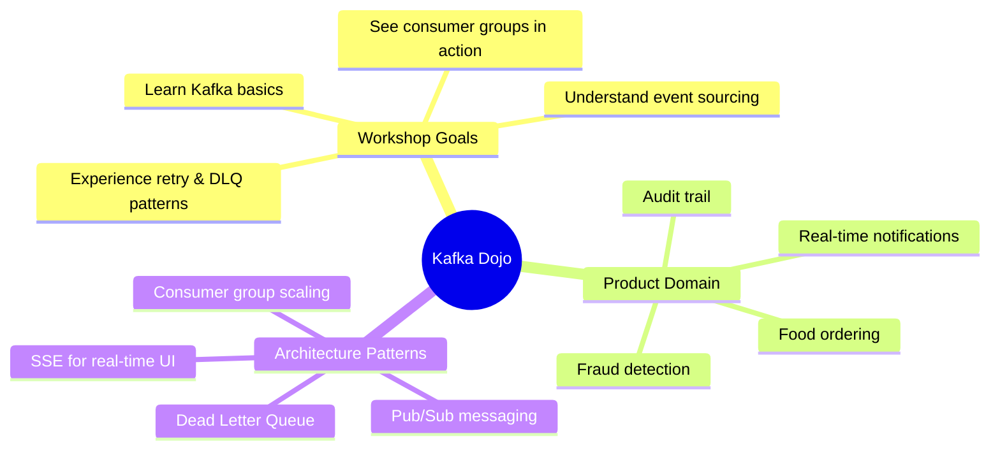
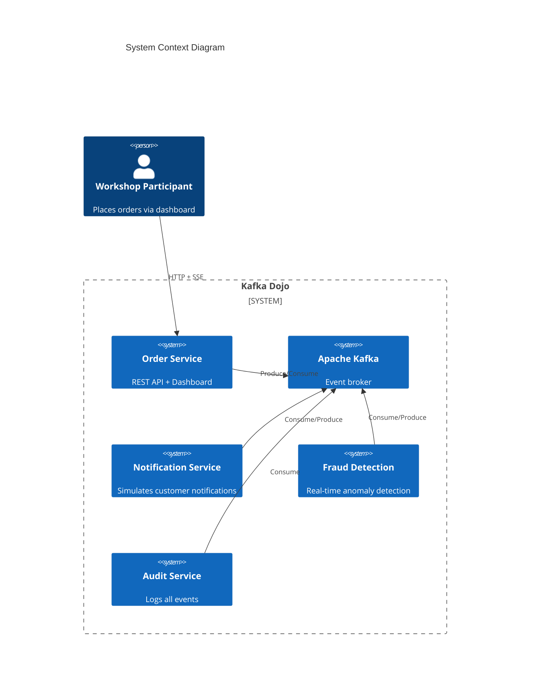
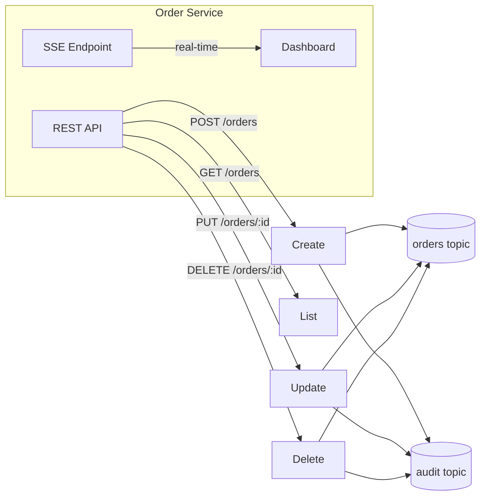
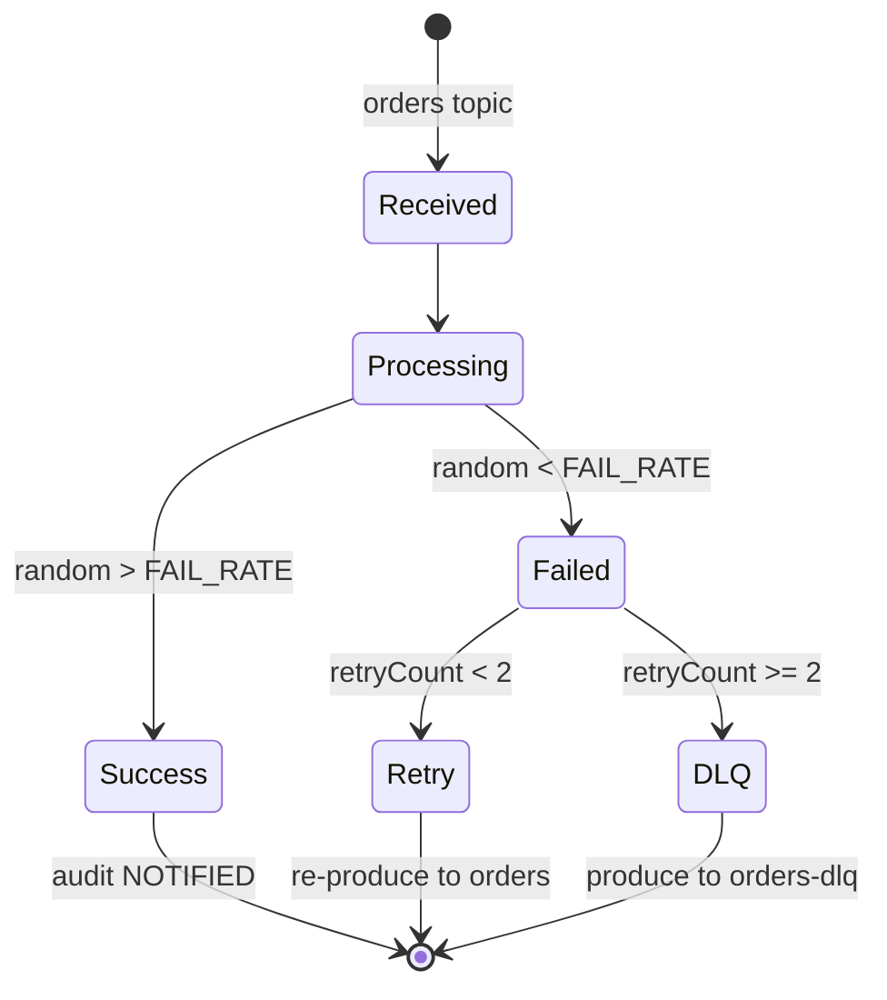
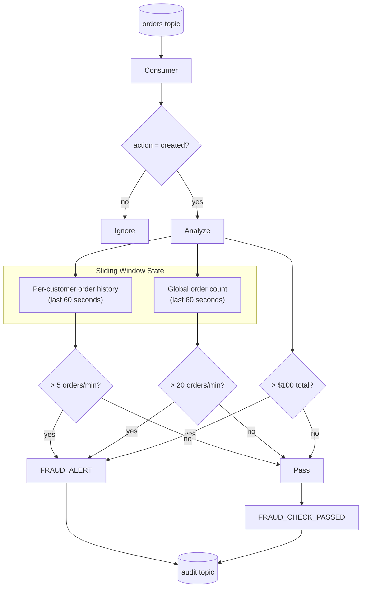
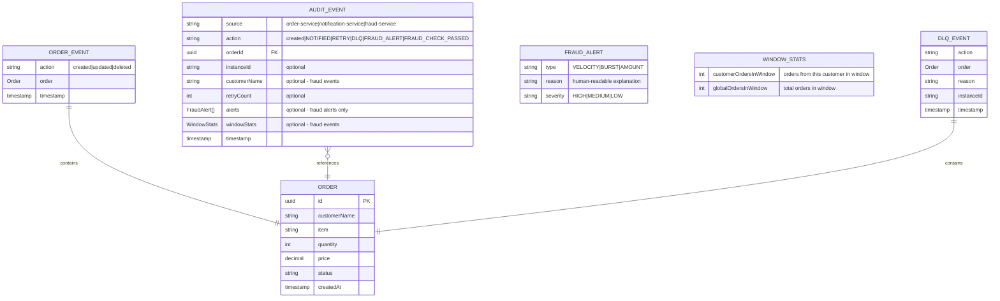
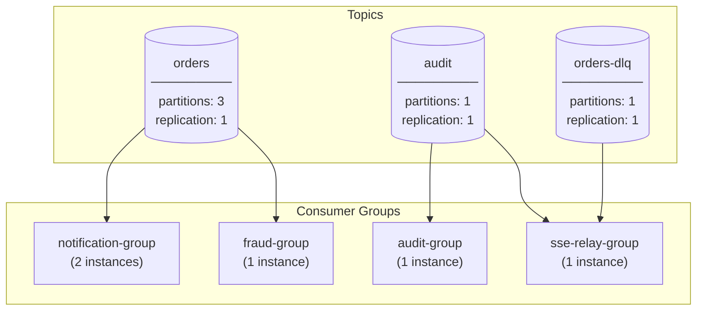
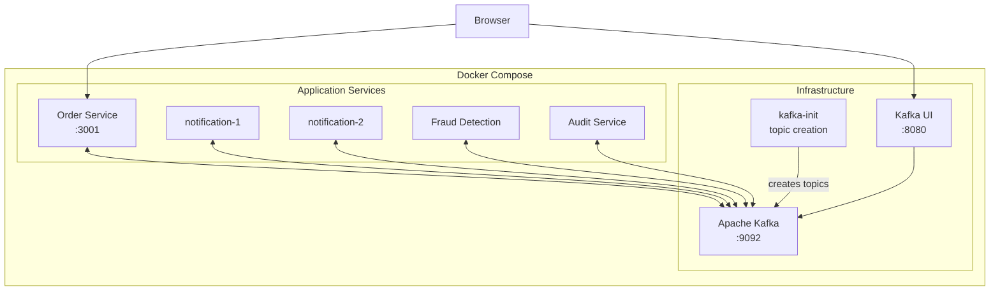
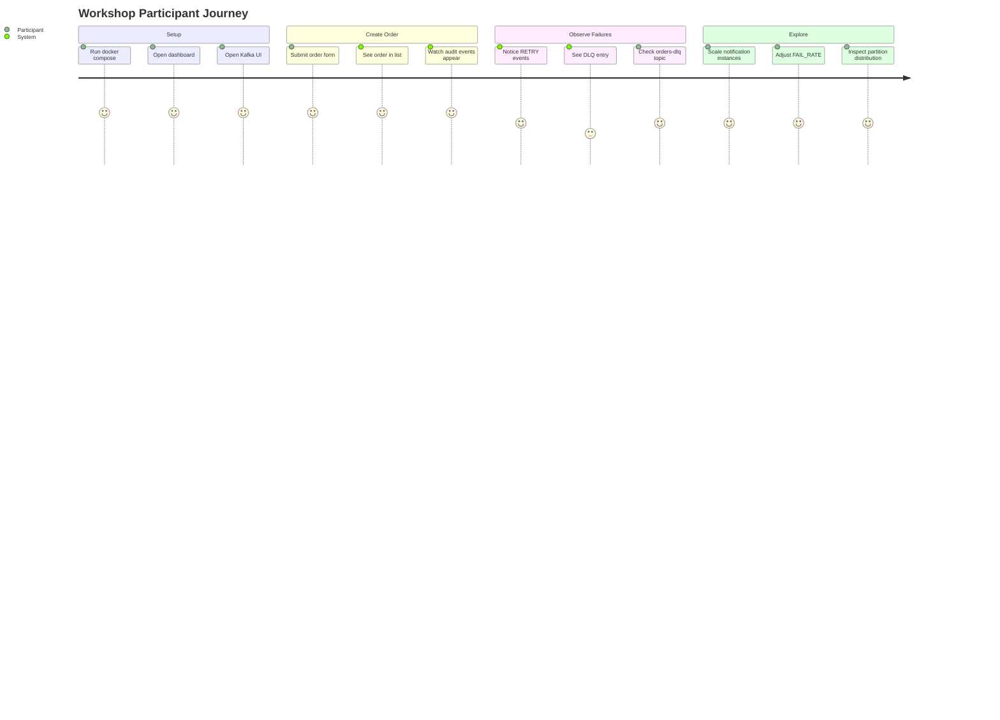

# Product Specification: Kafka Dojo

> A workshop demo for event-driven food ordering architecture

---

## 1. Vision

Build a **food ordering system** (think Uber Eats / Deliveroo backend) that demonstrates how **event-driven architecture** with Kafka decouples services, enables fault tolerance, and scales horizontally.

---

## 2. System Context

---

## 3. User Stories

| ID | As a... | I want to... | So that... |
|----|---------|--------------|------------|
| US-1 | Workshop participant | Create/update/delete orders via a dashboard | I can see events flow through the system |
| US-2 | Workshop participant | See real-time audit logs in the UI | I understand how events propagate |
| US-3 | Workshop participant | Observe notification failures and retries | I learn the retry/DLQ pattern |
| US-4 | Workshop participant | Trigger fraud alerts by spamming orders | I understand real-time event correlation |
| US-5 | Workshop participant | Inspect Kafka topics via UI | I can debug and explore messages |

---

## 4. Functional Requirements

### 4.1 Order Management

**Acceptance Criteria:**
- Orders have: `id`, `customerName`, `item`, `quantity`, `price`, `status`, `createdAt`
- All mutations produce to `orders` and `audit` topics
- Dashboard updates in real-time via SSE

### 4.2 Notification Processing

**Acceptance Criteria:**
- Run 2 instances in same consumer group (partition distribution)
- Configurable `FAIL_RATE` to simulate failures (default 30%)
- Max 2 retries before sending to DLQ
- Each state transition produces audit event

### 4.3 Fraud Detection — Real-time Anomaly Detection

> **Why Kafka?** Fraud detection requires correlating events over sliding time windows.
> You can't detect "6 orders in the last minute from same customer" with a DB query
> without expensive polling. Event streams make this natural and real-time.

**Acceptance Criteria:**
- **Velocity check** — flag customers placing > 5 orders/minute (HIGH severity)
- **Burst detection** — flag when > 20 orders/minute globally, potential bot attack (MEDIUM severity)
- **Amount anomaly** — flag orders > $100 total (LOW severity)
- Maintain sliding 60-second windows per customer AND globally
- Publish both alerts and passed checks to audit topic

### 4.4 Audit Trail

**Acceptance Criteria:**
- Consume all messages from `audit` topic
- Structured logging with: `source`, `action`, `orderId`, `instanceId`, `timestamp`
- No data persistence (logs to stdout)

---

## 5. Event Schemas

---

## 6. Topic Design

**Key decisions:**
- `orders` has 3 partitions → enables 2 notification instances to share load
- `audit` and `dlq` are single-partition → ordering matters, low volume
- Each service has its own consumer group → independent offsets

---

## 7. Non-Functional Requirements

| Category | Requirement |
|----------|-------------|
| **Deployment** | Single `docker compose up` to start everything |
| **Hot Reload** | Code changes reflect without container restart |
| **Observability** | Kafka UI available for topic inspection |
| **Simplicity** | No external database; in-memory state only |
| **Isolation** | Each service in its own container |

---

## 8. Deployment Architecture

---

## 9. Workshop Flow

---

## 10. Success Metrics

This workshop is successful when participants can answer:

1. **Why Kafka?** → Decoupling, fault tolerance, replay, scaling
2. **What is a consumer group?** → Multiple instances share partitions
3. **How do retries work?** → Re-produce with header, check count
4. **What is a DLQ?** → Parking lot for failed messages after max retries
5. **How does scaling work?** → Add consumers up to partition count

---

*Generated as a retrospective spec document for the Kafka Dojo workshop demo.*
